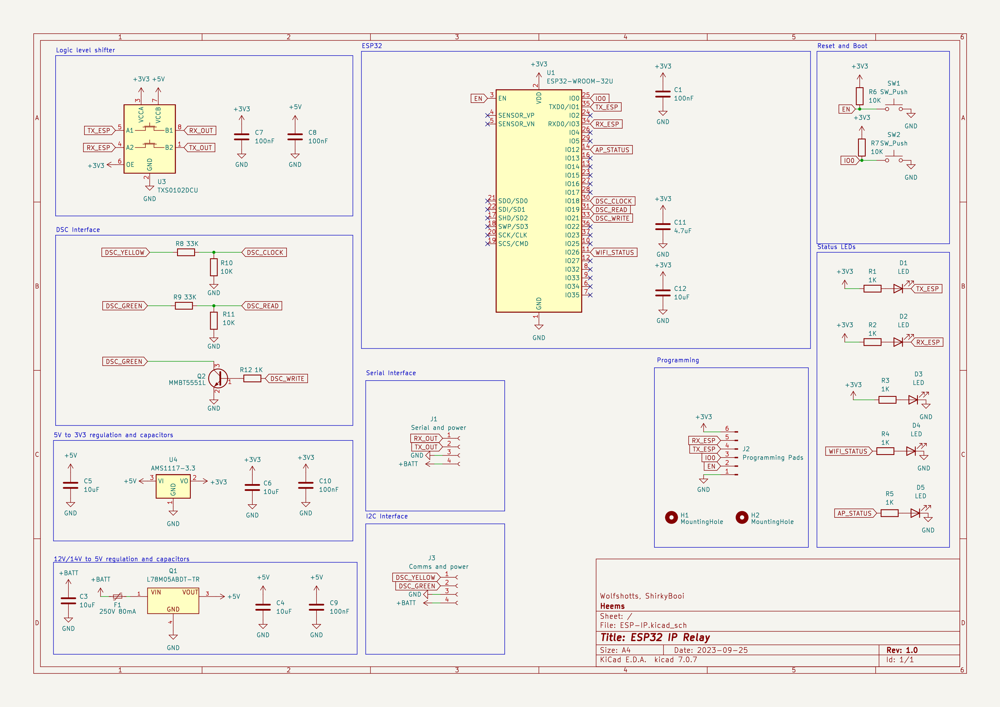

# ESP32 WiFi Network Interface Bridge

This project is a hardware solution that leverages the power of the ESP32 to bridge local communication interfaces, such as serial and (in the future) I2C, to a WiFi network. It allows devices with traditional communication interfaces to be accessed and controlled over WiFi.

## Features

- **Interface Bridging**: Convert and expose devices using:
  - Serial interface (current implementation)
  - I2C interface (planned for future releases)
  
- **WiFi Connectivity**:
  - Connect to an existing WiFi network.
  - Broadcast its own Access Point (AP) for direct connections.

- **Status Indicators**:
  - **Serial Communication**:
    - RX LED: Lights up when the device receives data.
    - TX LED: Lights up when the device transmits data.
  - **WiFi Indicators**:
    - Connection LED: Lights up when the device is connected to an external WiFi.
    - AP LED: Lights up when the device is broadcasting its own Access Point.

## Hardware Design

- Designed in KiCad.
- ESP32-WROOM-32U as the main microcontroller.

## Getting Started

### Prerequisites

- KiCad for viewing and editing the design files.
- A compatible power source for the board.

### Setup

1. **Power the board**: Connect the board to a suitable power source.
2. **Connection**:
    - For Serial: Connect your serial device to the designated serial port.
    - For I2C (Future): Connect your I2C device to the designated I2C connectors.
3. **WiFi**:
    - Connect to an existing WiFi: Set the credentials in the firmware and upload to the ESP32.
    - Use as AP: The board will automatically broadcast its AP if it fails to connect to the saved networks.

### Configuration

Details about how users can configure the firmware for specific WiFi networks, adjust baud rates for serial communication, or other configuration details.

## Future Enhancements

- Integration of the I2C interface.
- Firmware updates over the air.

## Contribute

We welcome contributions! Please read the [CONTRIBUTING.md](./CONTRIBUTING.md) for details on submitting pull requests to us.

## License

This project is licensed under the XYZ License - see the [LICENSE.md](./LICENSE.md) file for details.
